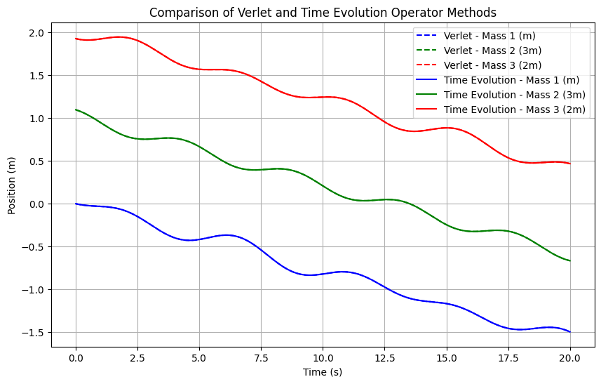
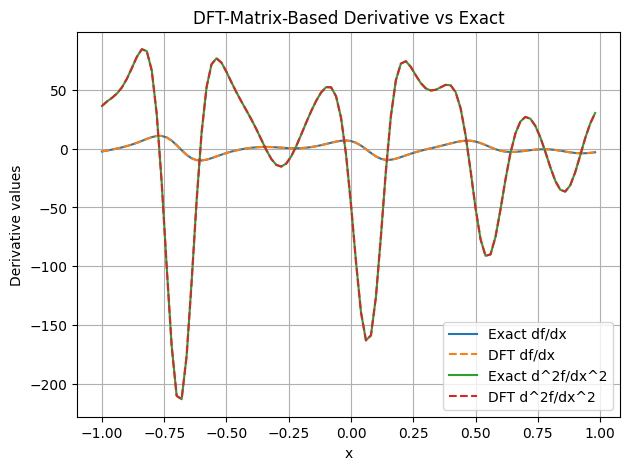
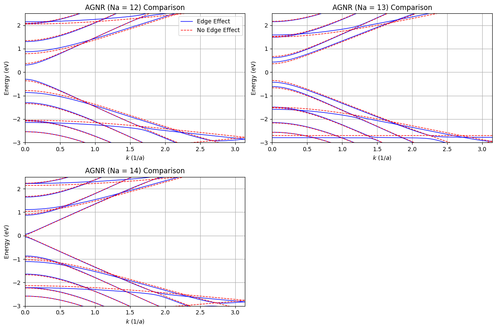
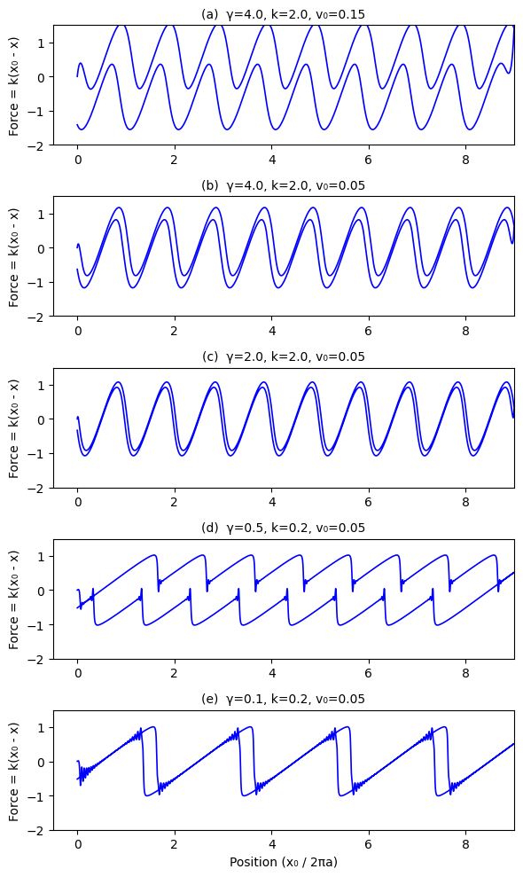
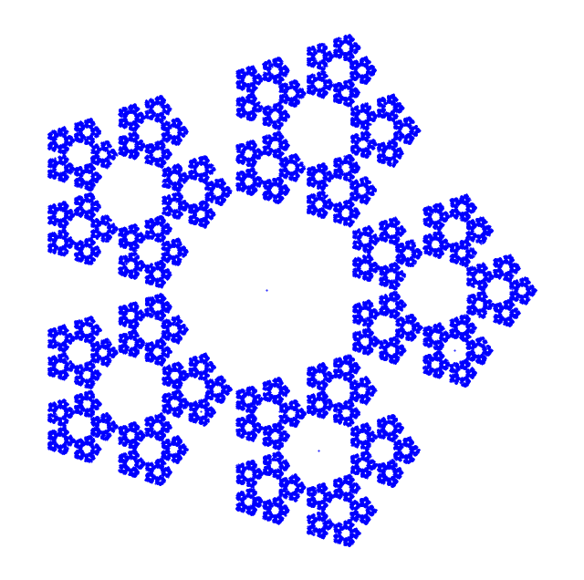
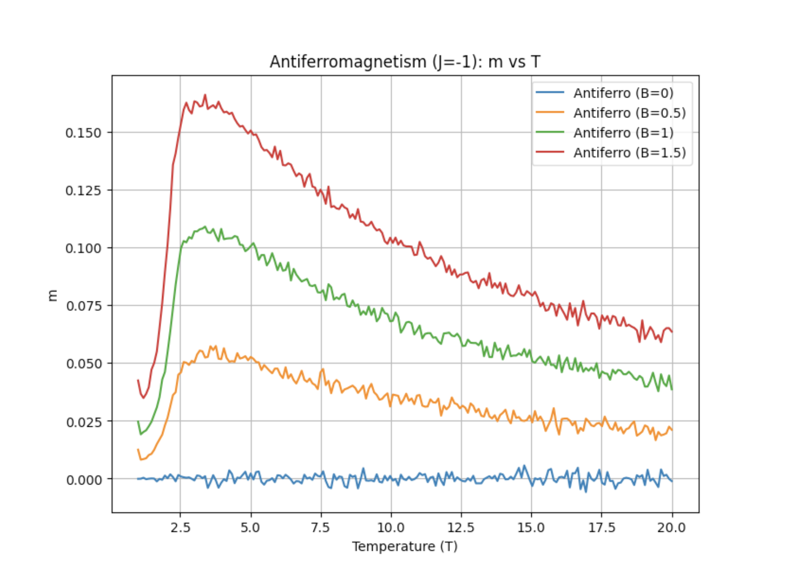

# Computational Science Studies

This repository contains codes and reports for various projects in computational science focused on material science and complex systems.

---

## Newton

  

    <h3>Simulation of a Three-Mass Spring System</h3>
    
Compares the velocity Verlet algorithm with the time-evolution operator method to simulate a three-mass system connected by springs.

  

  

    
  

---

## Fourier

  

    <h3>Derivative Approximation Methods</h3>
    
Analyzes and compares derivative approximation using Finite-Difference methods, FFT-based methods, and the DFT matrix approach on smooth, periodic functions.

  

  

    
  

---

## Schrödinger

  

    <h3>Tight-Binding Model for Graphene Nanoribbons</h3>
    
Implements a tight-binding model with modified edge hopping to calculate band structures of armchair graphene nanoribbons, highlighting the effect of edge corrections.

  

  

    
  

---

## Prandtl

  

    <h3>Prandtl-Tomlinson Model for Atomic-Scale Friction</h3>
    
Studies the PT model to simulate friction at the atomic scale, reproducing friction loops and analyzing the impact of thermal fluctuations via Langevin dynamics.

  

  

    
  

---

## Mandelbrot

  

    <h3>Fractal Geometry via the Chaos Game</h3>
    
This project extends the chaos game approach to generate a pentagonal fractal (often termed the “Sierpinski pentagon”). By iteratively moving a fraction toward randomly chosen vertices of a regular pentagon, the fractal emerges. Two methods are used to quantify its complexity: the self-similarity dimension, yielding Dself ≈ 1.6723, and the pointwise correlation dimension, with Dcorr ≈ 1.6750. These complementary approaches confirm the fractal’s scale-invariant nature.

  

  

    
  

---

## Metropolis

  

    <h3>Monte Carlo Simulation of the Ising Model</h3>
    
This work implements a Monte Carlo simulation of the 2D Ising model to explore magnetic phase transitions in both ferromagnetic (J = +1) and antiferromagnetic (J = −1) systems. The study examines the effects of temperature and external magnetic fields on order parameters, employing the Metropolis algorithm accelerated by numba for efficiency. Key observations include the behavior of magnetization and staggered magnetization, as well as the impact of non-ideal order parameters on the sharpness of phase transitions.

  

  

    
  

